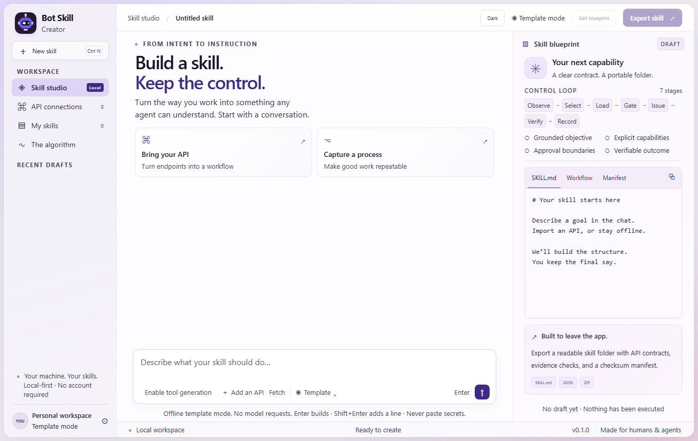
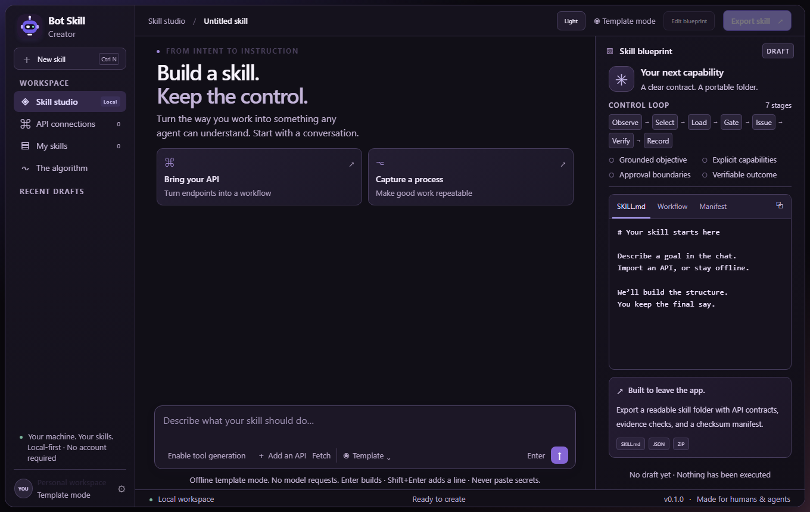

<p align="center"></p>
<h1 align="center">Bot Skill Creator</h1>
<p align="center"><strong>Describe the work. Ship the skill.</strong></p>
<p align="center">A local studio for anyone creating a bot skill they can read, review, and hand to a harness.<br>Drafts stay on your machine. API keys are sealed outside the app, never inside a skill.</p>
<p align="center"><strong>Local-first</strong> &nbsp;·&nbsp; <strong>Bring your model</strong> &nbsp;·&nbsp; <strong>OpenAPI → SKILL.md</strong> &nbsp;·&nbsp; <strong>No application dependencies</strong></p>
<p align="center"><a href="#start-in-one-command">Quick start</a> · <a href="#two-ways-in-one-way-out">Two modes</a> · <a href="#bring-your-apis">APIs</a> · <a href="#use-it-in-a-harness">For agents</a> · <a href="#the-algorithm-without-the-jargon">Algorithm</a> · <a href="#the-math">Math</a> · <a href="#repository-directory">Directory</a> · <a href="#what-has-been-tested">Tests</a></p>

<table>
<tr>
<td width="50%" align="center"></td>
<td width="50%" align="center"></td>
</tr>
<tr>
<td align="center"><sub>Light mode</sub></td>
<td align="center"><sub>Dark mode</sub></td>
</tr>
</table>

## From an idea to a reusable capability

“Read my warehouse inventory and draft a restock brief. Never place orders.”

Bot Skill Creator turns that request into a named folder containing the instructions,
selected API operations, approval boundaries, evidence checks, and a checksum manifest.
Inspect every file before exporting. Keep the result in your own repository or load it
through a compatible agent harness.

**The studio creates skills. It does not execute the business tasks inside them.**

The UI has a chat workspace, API operation selector, live file preview, editable blueprint,
saved drafts, math explorer, and exact-revision export review. A connected language model
can draft and refine your procedure. Without a model, the deterministic template mode
still works entirely offline and labels itself clearly.

## Start in one command

**Requires Python 3.11 or newer.** No Node.js, npm, database server, model download, or
Python package installation is required. Git is optional unless you want to clone.

Unzip the repository, open its folder, and run:

### macOS / Linux / Bash

```bash
cd bot-skill-creator
bash start.sh
```

### Windows / PowerShell

```powershell
Set-Location .\bot-skill-creator
.\start.ps1
```

If your execution policy blocks local scripts, use the direct Python entry point:

```powershell
py -3 -m bsc serve --open
```

The studio opens at **http://127.0.0.1:8717**. Press **Ctrl+C** in the terminal to stop it.
Use the printed `127.0.0.1` URL, not `localhost`; exact Host checks are intentional.

Alternative port or workspace:

```bash
python3 -m bsc serve --port 8899 --workspace ./my-workspace --open
```

```powershell
.\start.ps1 -Port 8899 -Workspace .\my-workspace
```

This is a working **single-user local release**, not an already-deployed public SaaS.
Do not expose the loopback server through a public tunnel. See [security](SECURITY.md).

## Two ways in. One way out.

| | Browser studio | Harness / CLI |
|---|---|---|
| Who it is for | Humans who want to design through chat and preview. | Agents and developers who want a composable authoring tool. |
| Input | Brief, refinements, blueprint editor, OpenAPI JSON. | JSON plan, brief, local OpenAPI file, or NDJSON requests. |
| Model | Optional Chat Completions-compatible endpoint. | Optional explicit `--model` call, or your harness drafts the plan. |
| Review | Visible files and a revision-bound export confirmation. | JSON preview and deterministic validation before an explicit write. |
| Output | A portable ZIP. | A portable folder, ZIP, or JSON response. |

Both interfaces call the **same compiler**. No browser-only export format or separate
agent-only fork exists. Generated packages use `SKILL.md` plus supporting reference and
script files; a particular harness still controls discovery, invocation and permissions.

## Create your first skill

Open **Add an API → Use example API** to try a fictional warehouse contract. Select
`listInventory` and leave `createPurchaseOrder` unselected. Return to the studio, describe
your read-only workflow, then inspect **SKILL.md**, **Workflow**, and **Manifest**.

Use **Edit blueprint** to refine the goal, required inputs, steps and success evidence.
For semantic back-and-forth, connect a model. In offline template mode, later chat messages
are added as explicit constraints rather than pretending a model rewrote the procedure.

Choose **Export skill**, review the exact revision, and approve the ZIP. The creator
checks the archive round trip before reporting success. That success is about the
artifact—not proof that a warehouse API request ran.

## Bring your APIs

### 1. A model API for drafting

Open the model selector in the skill studio. It reads Ollama at
`http://127.0.0.1:11434` and, when one model answers, fills the endpoint and model ID.
Ollama does not need an API key. The choice is remembered for the next session.
Other local programs, including a harness on another port, are not selected.
For a remote provider, enter the base URL, model ID, and API key, then press **Save key**.
Compatible providers expose `POST <base_url>/chat/completions`. No model is bundled.

Save key seals that provider's key in a folder outside the app
(`%LOCALAPPDATA%\BotSkillCreator\secrets` on Windows). The next session loads it into
process memory only when that provider is selected. The key is not written into project
JSON, browser storage, skill exports, or logs. A key you type but do not save still
lasts only for this server process. Configuration itself makes no test request. Your
next chat message sends the current brief, draft and selected operation summaries to
that provider and may incur charges.

Providers differ. Choose `max_completion_tokens` or `max_tokens`, and enable JSON-object
mode only when supported. Native non-compatible APIs need a separate adapter. Provider
errors are reported without an automatic billed retry.

### 2. An OpenAPI contract for the skill's capabilities

Import a bundled **OpenAPI 3.0.x or 3.1.x JSON** document and select operation IDs. The
creator reads the document; it does not contact the business API or authenticate to it.
Only selected operations are exported. By default, none are selected.

The future harness supplies the actual executor, credentials, resource scope, approvals
and evidence verifier. A contract is not a connection, and a GET method is not proof
that an operation is harmless. Generated contracts require host approval for all imported
API invocations.

[Full API setup, supported subset and credential boundaries →](docs/API.md)

## Use it in a harness

The **root `SKILL.md` is Bot Skill Creator itself**. Clone the complete repository into a
location your harness can read. Do not copy only that one file; it references the compiler
and docs alongside it. Configure your harness's skills directory explicitly.

If you received the optional Git bundle, clone it without a remote server:

```bash
git clone ./bot-skill-creator.bundle bot-skill-creator
cd bot-skill-creator
```

```powershell
git clone .\bot-skill-creator.bundle bot-skill-creator
Set-Location .\bot-skill-creator
```

After publishing to your own Git host, replace the bundle path with that repository URL.
This archive does not assume or claim that a public GitHub remote already exists.

### Build the included example

Bash:

```bash
python3 scripts/bsc.py create \
  --plan examples/inventory-plan.json \
  --openapi examples/warehouse.openapi.json \
  --operations listInventory \
  --out ./exports

python3 scripts/bsc.py validate ./exports/inventory-brief
python3 scripts/bsc.py zip ./exports/inventory-brief --out ./inventory-brief.zip
python3 scripts/bsc.py install ./exports/inventory-brief --target ./my-harness/skills
```

PowerShell:

```powershell
py -3 .\scripts\bsc.py create `
  --plan .\examples\inventory-plan.json `
  --openapi .\examples\warehouse.openapi.json `
  --operations listInventory `
  --out .\exports

py -3 .\scripts\bsc.py validate .\exports\inventory-brief
py -3 .\scripts\bsc.py zip .\exports\inventory-brief --out .\inventory-brief.zip
py -3 .\scripts\bsc.py install .\exports\inventory-brief --target .\my-harness\skills
```

Existing output folders and ZIPs are **not overwritten**. Choose a new output name for a
new version. `install` copies the package; it does not run the skill or configure a vendor.

For preview-only operation, replace `create` with `preview`. The `bridge` command accepts
one JSON request per line and returns one JSON response per line. It is NDJSON, **not MCP**.

[Python integration and complete bridge contract →](docs/HARNESS.md)

## What leaves the studio

```text
inventory-brief/
├── SKILL.md                   # Instructions the agent loads
├── README.md                  # Quick guide for a human
├── skill.json                 # The authored plan and metadata
├── manifest.json              # File hashes and validation scope
├── references/
│   ├── api-contract.json       # Only selected operations; no credentials
│   ├── workflow.json          # Stages, host gates and stop conditions
│   ├── HARNESS.md              # What the future runtime must provide
│   └── MATH.md                 # The full derivation and limitations
└── scripts/
    └── validate.py             # Standalone offline checksum check
```

Check an exported skill without this app:

```bash
cd inventory-brief
python3 scripts/validate.py
```

```powershell
Set-Location .\inventory-brief
py -3 .\scripts\validate.py
```

## The algorithm, without the jargon

**Observe → select → load → gate → issue → verify → record.**

Understand the work. Include only the capabilities needed. Prepare the exact proposal.
Check who authorized it. Issue it once locally. Verify what actually happened. Keep the evidence.

The model can draft the procedure. It cannot make itself the authority. Unknown external
outcomes stop automatic retry. Changed arguments invalidate approval for an older proposal.
The creator applies this separation to its own reviewed artifact exports and includes
it as a host contract in generated skills.

**A skill teaches the process; the harness must enforce it.** Markdown is not a sandbox.

[Readable algorithm →](docs/ALGORITHM.md) · [Host architecture →](docs/ARCHITECTURE.md)

## The math

For one skill-step binding, version, objective and context, let S be verified successes,
F verified failures, and U terminal unknown outcomes. Under the explicit
Dirichlet(1,1,1) prior:

$$\hat q=\frac{S+F+2}{S+F+U+3},\qquad
\hat\mu=\frac{S+1}{S+F+2},\qquad
\boxed{\hat\theta=\hat q\hat\mu=\frac{S+1}{S+F+U+3}}.$$

**q** estimates whether an outcome will be verifiable. **μ** estimates success conditional
on verification. **θ** estimates verified success. Unknown outcomes lower q without
pretending to be a verified failure. No history starts at θ=1/3 by construction.

Among eligible, comparable alternatives:

$$s^*=\arg\max_s[\hat\theta_s-\lambda c_s].$$

Cost must use one declared normalized scale. Permission is a separate hard gate—not a
penalty that a high score can overcome. This release demonstrates the formula and preserves
the reference router; it does not claim calibrated probabilities or improved agent success.

[Hardcore mathematics, assumptions and proof boundaries →](docs/MATH.md)

## Repository directory

```text
bot-skill-creator/
├── SKILL.md                   # Creator skill for a harness
├── README.md                  # You are here
├── AGENTS.md                  # Development instructions and invariants
├── start.sh / start.ps1        # One-command launchers
├── bsc/
│   ├── __main__.py / cli.py    # CLI and NDJSON bridge
│   ├── core.py                # One deterministic skill compiler
│   ├── control.py             # Preserved BOT Agent Algorithm kernel
│   ├── discover.py            # Reads Ollama on this machine
│   ├── keystore.py            # Seals provider keys outside the app
│   ├── openapi.py             # Read-only OpenAPI subset importer
│   ├── providers.py           # Optional compatible model API transport
│   ├── security.py            # Input and endpoint boundaries
│   ├── workspace.py           # Drafts, revisions, artifact issue/resolve
│   ├── server.py              # Local HTTP interface
│   └── web/                   # macOS-inspired HTML, CSS and chat UI
├── templates/                 # Compiler-owned control template
├── examples/                  # Fictional API + a reviewed example plan
├── scripts/                   # CLI entry point and optional browser smoke test
├── tests/                     # Offline controller, compiler, HTTP and provider tests
├── docs/
│   ├── ALGORITHM.md / MATH.md  # Plain-English guide and detailed derivation
│   ├── API.md / HARNESS.md     # Both integration experiences
│   ├── ARCHITECTURE.md         # Components and trust boundaries
│   ├── TESTING.md              # Reproduce checks and understand their limits
│   ├── PROVENANCE.md           # Source continuity and unchanged hashes
│   ├── LAUNCH_KIT.md           # Honest positioning and share-ready copy
│   ├── assets/                # Screenshots of the implemented interface
│   └── provenance/            # Original algorithm specification, unchanged
├── WHITE_PAPER/               # Research/design context for humans and agents
├── .github/                   # CI definition and issue templates
├── CHANGELOG.md
├── CONTRIBUTING.md
├── SECURITY.md
└── LICENSE
```

## What has been tested

Run the dependency-free suite:

```bash
python3 -m unittest discover -s tests -v
```

```powershell
py -3 -m unittest discover -s tests -v
```

The release includes an actual test transcript in [docs/test-results.txt](docs/test-results.txt).
Coverage includes the inherited controller, contract import, deterministic compilation,
credential exclusion, stale export approvals, duplicate issuance, HTTP boundaries,
provider error handling and standalone exported-package checks.

Chromium UI smoke checks exercise imports, selection, chat, editing, export, library,
model configuration and responsive layout. The managed browser environment uses mounted
UI assets and a Python HTTP bridge; direct browser networking is not claimed tested.
The tests use simulated model responses—**no paid live-provider test or business API run**.
Native Windows/macOS launch behavior has not been executed in this build environment.
The CI matrix is provided for those checks; a workflow file is not a completed CI run.

Verify a packaged release with `python3 scripts/verify_release.py` or
`py -3 .\scripts\verify_release.py`. The release manifest covers the distributed
source files, docs and screenshots; consistency is not a cryptographic guarantee of authorship.

[Full validation scope and reproducible commands →](docs/TESTING.md)

## Deliberate boundaries

v0.1 supports single-user local authoring, compatible model APIs, a documented OpenAPI
subset, and portable instruction packages. It does not include user accounts, public
hosting, multi-tenant billing, automatic business-API execution, OAuth onboarding,
a universal harness adapter, native desktop binaries or autonomous skill promotion.

These are product boundaries, not hidden placeholders behind “Connect” buttons.
API import means import. Model configuration means configuration until a request succeeds.
A static validation pass does not claim live correctness or end-to-end security.

## Make something worth sharing

Start with one real workflow. Name it clearly. State when it applies and how success is
verified. Share a readable example—not a promise that it can do everything.

[Contribute a reproducible example](CONTRIBUTING.md) · [Launch copy](docs/LAUNCH_KIT.md) · [License](LICENSE)

Created for **James Paul Jackson**. Original BOT Skills files remain separate and unchanged.
New code in this repository is MIT licensed; generated content is not automatically assigned
that license. Source lineage is documented rather than passed off as a new mathematical result.

### Format and protocol references

- [Agent Skills specification](https://agentskills.io/specification)
- [OpenAPI 3.1.1](https://spec.openapis.org/oas/v3.1.1.html)
- [Chat Completions request contract](https://developers.openai.com/api/reference/resources/chat/subresources/completions/methods/create)

These support format choices, not performance claims for Bot Skill Creator.
